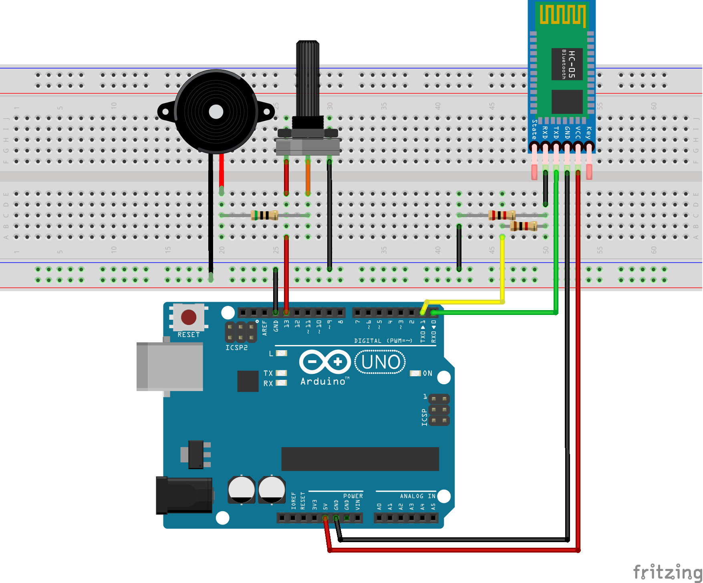

# Arduino Bluetooth Music
A system that plays simple music through a buzzer or speaker using Arduino

**Description**

This repository contains a program which runs on a computer that sends the notes to the Arduino, allowing songs too large to be stored on the arduino to be played. Note that all the songs are played note by note using square waves because the Arduino has trouble playing sound files in real time.

Volume can be controlled using the potentiometer and custom songs can be made by following the format below. This setup is limited to only being able to play one track at a time.

The code for the Arduino is set to recieve information from the bluetooth module at a baud rate of 38400, so make sure to either configure your bluetooth module to this rate or change the value in the file.

**How to play music**

Compile the file arduino.ino onto the Arduino (make sure that the wires connected to pins 0 and 1 are disconnected when you do this otherwise you will not be able to compile to the board!).

Once the circuit has been assembled, pair the bluetooth module to your computer and run the program music.py using Python. The first time you run the program it will ask you for the MAC address of your bluetooth module, then the path to the song you would like to play. There are several test songs included in the songs folder of this repository.

If everything has been set up correctly, the program will display the notes currently being played through the speaker and you will hear the music.

**Schematic**

Components:

* Arduino UNO or similar
* 10k potentiometer
* 50Ω resistor
* 100Ω resistor
* 200Ω resistor
* Buzzer or speaker
* HC-05 Bluetooth module or similar

_The resistors on this list can be replaced by smaller resistors in series or by bigger resistors in parallel_

**Song file format**

There are some example songs included in the songs folder of this repository, but if you would like to make your own custom songs they follow a simple format:

The first line of the file must be a number (I would recommend 0.3 or 0.4) that specifies how long a whole note would take to play in seconds.

The second line is an array of strings containing the letter of each note followed by a number from 0-9 indicating the octave of the note. For example:
["G5", "C5", "Ab7"]

Rests can be created by adding notes with an octave of zero, such as A0.

The third and final line is an array of floating point numbers that indicate the duration of the note relative to the whole note. A whole note would take on the value of 1, while a quarter note would take on a value of 0.25. For example: [0.5, 0.5, 0.33, 0.33, 1, 4, 0.25]

The file will not be played if the amount of notes is not the same as the amount of durations.