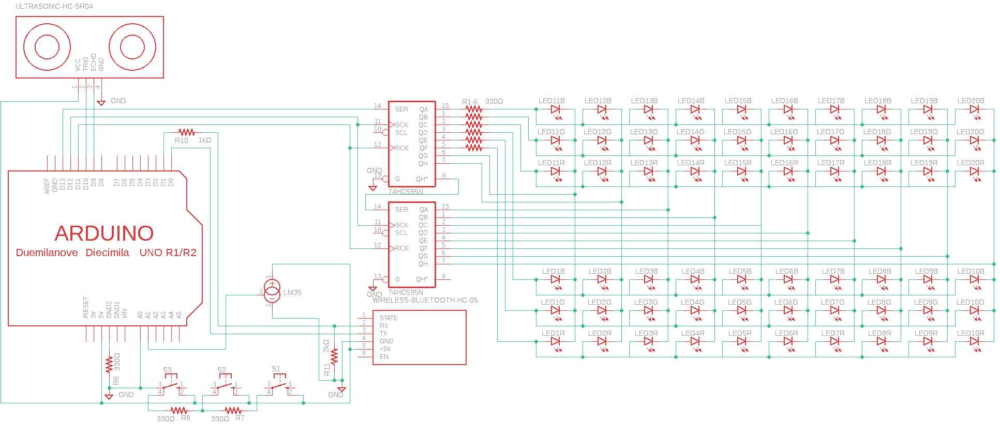

# Midterm Project for Logic Automata Lab
The goal is to create a machine that analyzes a glass of liquid (level and temperature) and output the results using an array of 20 RGB LEDs. As an extra, we will be creating a web server that connects to the machine via bluetooth that allows the user to debug the machine.

An important point of this project is that costs must be minimized, so this project is restricted to using certain objects in order to favour costs.

**Schematic**

**Materials:**

* Arduino UNO
* Ultrasonic sensor HC-SR04
* Temperature sensor DHT11
* 20 RGB LEDs
* 2x 8 bit SIPO Shift Register (75HC595)
* Bluetooth module
* 3x Configuration buttons

**References:**

[https://weworkweplay.com/play/practical-guide-to-shift-registers/]

[https://create.arduino.cc/projecthub/najad/100-switches-in-a-single-pin-of-arduino-750c42]

[https://howtomechatronics.com/tutorials/arduino/ultrasonic-sensor-hc-sr04/]

[https://learn.adafruit.com/dht/connecting-to-a-dhtxx-sensor]