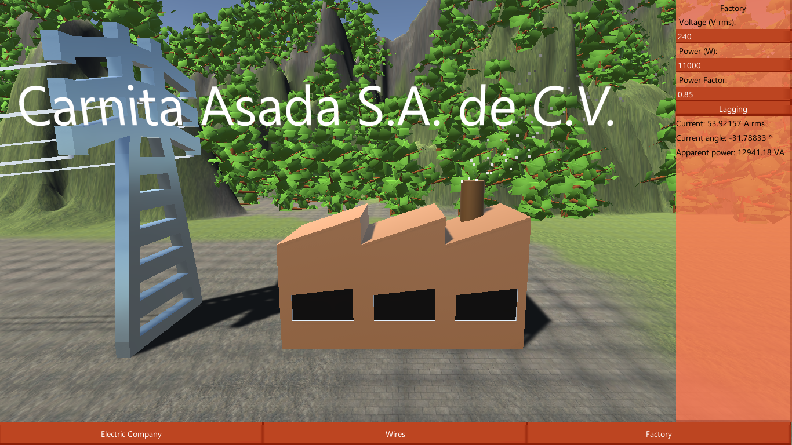

# Carnita Asada
This is an extra project I am making for Circuits II which will demonstrate the loss of power caused by transporting electricity via wires over long distances and the use of a transformer in order to convert voltages.

[Link to the demonstration.](https://jamesscn.github.io/CarnitaAsada/)

Carnita Asada S.A. de C.V. is a company that grills meat, however they are trying out new ways to power their factory so you need to decide what voltage, power input and power factor is used. With this, you can see how much power is really needed to keep a factory running.

Music: **Disco con Tutti** Kevin MacLeod (incompetech.com)
Licensed under Creative Commons: By Attribution 3.0 License
http://creativecommons.org/licenses/by/3.0/