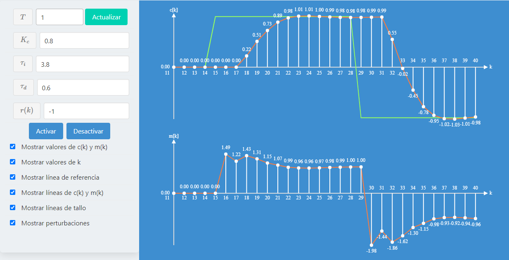

# DiscretePlantSimulator
A web server that can run on an embedded device or computer and simulate a discrete control system plant.

[You can find an interactive version of the simulator here.](https://github.com/Jamesscn/ClassProjects/tree/master/discrete-control-simulator)

Made for the final project of MR2007.1 - Control Computarizado