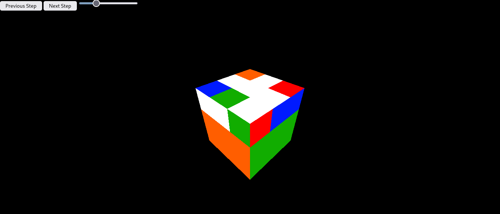

# Proyecto Final del Laboratorio de Mecatrónica
## Robot Autonomo para Cubos Rubik

Este proyecto consistió en construir un robot que pueda resolver un cubo rubik de una manera no invasiva. El robot observa las seis caras del cubo mediante una cámara, y luego aplica el algoritmo de Kociemba para resolver el cubo.

## Como correr el código

El código incluido en este repositorio corre en una Raspberry Pi 4 modelo B, y hace uso de las siguientes librerías:

- [gpiozero](https://gpiozero.readthedocs.io/en/stable/)
- [NumPy](https://numpy.org/)
- [OpenCV](https://opencv.org/)
- [TwoPhaseSolver de HKociemba](https://github.com/hkociemba/RubiksCube-TwophaseSolver)

Para correr este código, se requiere correr el programa main.py usando Python 3:

`python3 main.py`

## Como usar la interfaz gráfica

La interfaz gráfica se encuentra en la carpeta server/, y tiene las siguientes dependencias:

- [Node.js](https://nodejs.org/en/)
- [Three.js](https://threejs.org/)
- [Express](https://expressjs.com/)

Si se desea correr la interfaz gráfica, se deben descargar estas dependiencias y correr el programa app.js con node:

`node app.js`

Luego, se puede acceder a la interfaz conectandote al puerto 3000 de localhost desde tu navegador, o conectandote a la dirección IP de la Raspberry Pi.

**Vista de la interfaz:**

Para controlar la interfaz, se puede presionar el boton de Next Step para observar cual es el siguiente paso para resolver el cubo, el boton de Previous Step para regresar un paso, las teclas de las flechas para mover la cámara y el slider de arriba para controlar la velocidad de las animaciones.

## Otras notas

Este código y proyecto fue elaborado por el Equipo #2 de la clase de Laboratorio de Mecatrónica.